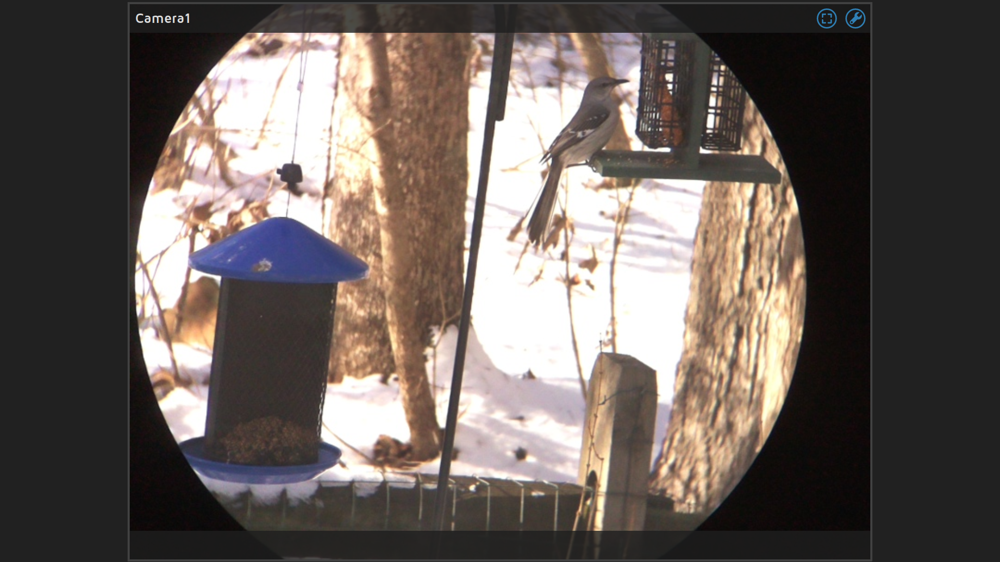

# birdcam

A collection of assets for my bird feeder camera.

## Hardware
* Binoculars & tripod
* Raspberry Pi 2/3/4
* [Pi Camera v2 & cable][1] 
* [Bumper case][2] 
* [Camera eypiece adapter][3] (use OpenScad to customize the size & fit)
* small screws to attach the camera board to the adapter
* Velcro strap to attach pi to the binoculars

## Software
* [MotionEye][4]

## Setup
* Use the [fast network camera][5] back-end for a faster frame-rate

[1]: https://www.raspberrypi.org/products/camera-module-v2/
[2]: https://www.thingiverse.com/thing:629886
[3]: https://www.thingiverse.com/thing:1565909
[4]: https://github.com/ccrisan/motioneyeos/wiki
[5]: https://github.com/ccrisan/motioneyeos/wiki/Fast-Network-Camera
